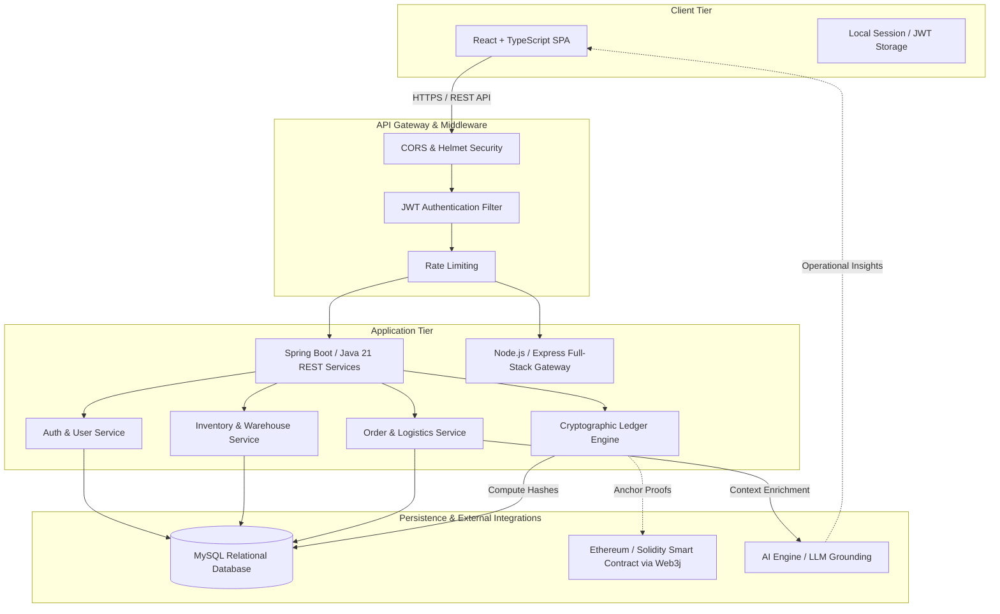
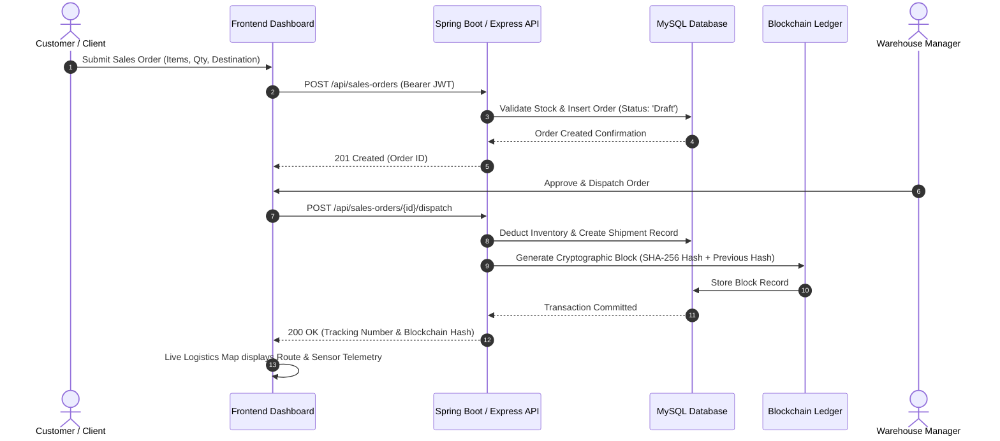

# NEXUS – AI-Powered Blockchain-Based Supply Chain & Warehouse Management System

> A modular, enterprise-grade supply chain and warehouse management platform integrating relational persistence, cryptographic ledger verification, role-based access control, and an intelligent AI assistant.

---

## 1. Project Title

**NEXUS: AI-Powered Blockchain-Based Supply Chain & Warehouse Management System**

---

## 2. Project Overview

NEXUS is a web-based enterprise platform designed to solve operational friction in multi-party supply chains. Modern logistics networks suffer from data silos, inventory discrepancies, untracked environmental conditions during transit, and manual administrative overhead.

NEXUS centralizes end-to-end supply chain operations—including supplier catalogs, warehouse capacity tracking, SKU-level inventory controls, purchase/sales orders, and cold-chain sensor telemetry—into a unified administrative dashboard. The system integrates a cryptographic ledger for tamper-evident transaction auditing and an artificial intelligence assistant for contextual operational queries.

---

## 3. Problem Statement

Traditional supply chain management systems face several critical challenges:

1. **Information Asymmetry & Data Silos**: Disconnected databases between vendors, warehouse operators, and logistics partners cause stockouts, over-ordering, and delivery delays.
2. **Vulnerability to Record Tampering**: Centralized mutable databases can be altered without leaving verifiable audit trails, creating trust issues regarding custody transfers and order histories.
3. **Cold Chain Degradation**: Sensitive goods (e.g., pharmaceuticals, perishable foods, precision electronics) lack real-time threshold monitoring for ambient temperature and humidity during transit.
4. **Cognitive Overhead in Inventory Analysis**: Warehouse operators spend significant time parsing disparate spreadsheets and reports to identify low-stock risks and reorder thresholds.
5. **Inflexible Access Controls**: Multi-tenant or multi-tier enterprise systems often lack granular role-based permissions, leading to security and governance vulnerabilities.

---

## 4. Proposed Solution

NEXUS provides an integrated, resilient architecture that addresses these challenges through:

- **Centralized Operational Hub**: A responsive Single Page Application (SPA) providing real-time visibility across inventory, orders, shipments, and supplier performance.
- **Relational Data Integrity**: A structured MySQL database schema enforcing foreign key constraints, transactional consistency (ACID), and normalized entity relations.
- **Dual-Layer Immutable Ledger**:
  - *Cryptographic Hash Chain*: Every critical state change (order dispatch, stock movement, delivery confirmation) is hashed via SHA-256 and chained to the previous block with HMAC signatures.
  - *Smart Contract Integration (Solidity/Web3j)*: Ethereum-compatible smart contract interfaces to register and verify supply chain events on a decentralized blockchain network.
- **Intelligent Operational Insights**: An integrated AI service grounded in live database state that helps operators query inventory health, identify bottlenecks, and inspect ledger proofs.
- **Role-Based Security**: JSON Web Token (JWT) authentication enforcing distinct privileges across Administrator, Warehouse Manager, Supplier, and Customer roles.

---

## 5. Objectives

- **Operational Efficiency**: Streamline inventory updates, warehouse capacity allocations, and order lifecycles through standardized RESTful endpoints.
- **Auditability & Non-Repudiation**: Guarantee that order dispatches, status transitions, and stock adjustments cannot be altered retroactively without breaking cryptographic hashes.
- **High-Fidelity Telemetry**: Monitor shipment environmental thresholds (temperature, humidity) and flag compliance violations automatically.
- **Developer & Interview Readiness**: Exhibit clean architectural separation of concerns (Separation of Concerns / Layered Architecture), comprehensive API documentation, unit/integration testing strategies, and containerized deployment.

---

## 6. Key Features

To maintain transparency, features are categorized by their implementation status:

### Implemented Features
- [x] **JWT Authentication & RBAC**: Stateless token authentication with BCrypt password hashing and route guards for `ADMIN`, `WAREHOUSE_MANAGER`, `SUPPLIER`, and `CUSTOMER`.
- [x] **Warehouse Management**: Track warehouse facilities, geographical locations, maximum storage capacities, and utilized volume metrics.
- [x] **SKU-Level Inventory Tracking**: Real-time stock levels, reorder threshold alerts, batch numbers, barcodes, and automated low-stock warnings.
- [x] **Supplier & Customer Directories**: Profiles, contact records, ratings, and associated order histories.
- [x] **Purchase & Sales Order Workflows**: Multi-item order creation, status transitions (`Draft` → `Processing` → `Shipped` → `Delivered`), and automatic inventory adjustments upon fulfillment.
- [x] **Logistics & Cold-Chain Telemetry**: Live transit monitoring with tracking numbers, origin/destination coordinates, and simulated IoT sensor feeds (temperature, humidity).
- [x] **Cryptographic Ledger Audit Engine**: SHA-256 block generation, HMAC verification, and an in-browser audit tool that verifies mathematical integrity of previous-hash linkages.
- [x] **AI Assistant Module**: Integrated chat interface grounded in system schemas to answer inventory, logistics, and verification queries.
- [x] **Interactive OpenAPI/Swagger Documentation**: Live interactive REST API specification available at `/api-docs`.
- [x] **Responsive Dashboard UI**: Dark/Light mode toggle switch, tabular search/filtering, and analytical status charts.

### Planned & In-Progress Features
- [ ] **Physical On-Chain Gas Optimization**: Batching off-chain telemetry reports into Merkle trees before anchoring on-chain via Web3j.
- [ ] **Multi-Factor Authentication (MFA)**: TOTP-based secondary authentication for administrative actions.
- [ ] **Automated Reorder Dispatch**: Webhook integrations to automatically issue purchase orders to suppliers when stock falls below safety points.
- [ ] **Hardware IoT Gateway**: Direct MQTT/CoAP broker ingestion for physical sensor hardware (e.g., ESP32 / Arduino).

---

## 7. System Architecture

The application follows a decoupled client-server architecture. The frontend communicates with the backend via RESTful JSON APIs. The backend coordinates with the relational database, executes cryptographic verification, interacts with smart contracts, and delegates natural language queries to the AI service.



---

## 8. Technology Stack

| Layer / Domain | Technology | Purpose in NEXUS |
| :--- | :--- | :--- |
| **Frontend Framework** | React 19 / 18 | Declarative component UI rendering for the single-page dashboard. |
| **Language (Frontend)** | TypeScript | Static type safety across state management, API models, and UI props. |
| **Build Tool** | Vite | Fast module bundling, HMR, and optimized static production builds. |
| **Styling & UI** | Tailwind CSS | Utility-first responsive design, light/dark mode theming, and layout structure. |
| **Icons & Motion** | Lucide React / Motion | Accessible vector icons and hardware-accelerated UI transitions. |
| **Primary Backend** | Java 21 & Spring Boot 3 | Enterprise REST API, Spring Security, JPA/Hibernate, and dependency injection. |
| **Alternate / Gateway Backend** | Node.js & Express | Lightweight API gateway, dynamic OpenAPI/Swagger serving, and dev server. |
| **Database** | MySQL 8.0 | Normalized relational persistence with ACID transactions and foreign key constraints. |
| **Authentication** | JWT (JSON Web Tokens) | Stateless authentication passing signed user claims between client and server. |
| **Password Security** | BCrypt | Cryptographic salt-and-hash storage for user passwords. |
| **Blockchain Integration** | Solidity & Web3j | Smart contracts on EVM networks for tamper-resistant transaction logging. |
| **AI Insights** | LLM Grounding API | Contextual supply chain Q&A, stock bottleneck analysis, and anomaly explanations. |
| **API Documentation** | Swagger / OpenAPI 3.0 | Self-documenting endpoint schemas with interactive request/response testing. |
| **Containerization** | Docker & Docker Compose | Multi-container environment orchestration for reproducible local and cloud setups. |

---

## 9. Project Modules

### 1. Authentication Module
- Handles user registration, credentials validation, and JWT issuing.
- Protects private routes using role guards (`ADMIN`, `WAREHOUSE_MANAGER`, `SUPPLIER`, `CUSTOMER`).
- Password hashing utilizing BCrypt with configurable salt rounds.

### 2. Dashboard Module
- Displays high-level Key Performance Indicators (KPIs): Total SKUs, Low Stock alerts, Active Shipments, Ledger Height, and Warehouse Utilization.
- Offers interactive theme toggling (Light/Dark mode) and notification panels.

### 3. Inventory Module
- Tracks items by SKU, product category, unit price, quantity on hand, and reorder point.
- Validates barcodes, batch numbers, and expiration dates.
- Triggers visual and logistical alerts when quantity falls below the minimum safety threshold.

### 4. Warehouse Module
- Maintains records of physical distribution centers, managers, and geographical coordinates.
- Monitors warehouse capacity limits (e.g., cubic meters / total pallets) and dynamically updates used capacity.

### 5. Supplier Module
- Centralizes supplier directories with contact personnel, phone/email records, and quality ratings.
- Links suppliers to catalog items and past purchase orders.

### 6. Order Management Module
- **Purchase Orders (PO)**: Procurement orders sent to suppliers to replenish warehouse inventory.
- **Sales Orders (SO)**: Customer-facing orders that allocate and decrement warehouse stock upon dispatch.
- Manages complete lifecycle states: `Draft`, `Submitted`, `Approved`, `Shipped`, `Received`, and `Cancelled`.

### 7. Logistics & Telemetry Module
- Tracks point-to-point shipments between suppliers, warehouses, and customers.
- Ingests simulated telemetry data (GPS coordinates, temperature, humidity).
- Identifies out-of-boundary sensor events (e.g., cold chain temperature violations exceeding safety thresholds).

### 8. Analytics Module
- Aggregates order volumes, stock distribution across warehouses, and fulfillment metrics.
- Presents structured historical data to support replenishment forecasting.

### 9. Blockchain Ledger Module
- Computes SHA-256 parent-linked hashes for every dispatch, delivery, and stock adjustment.
- Signs blocks using HMAC cryptographic signatures.
- Exposes an interactive audit tool allowing any operator to re-compute and mathematically verify chain validity.
- Provides Solidity smart contract code (`NexusSupplyChain.sol`) for EVM on-chain verification.

### 10. AI Assistant Module
- Natural language chat assistant with operational supply chain context.
- Answers queries regarding low-stock items, supplier reliability, and shipment delays based on real database records.

---

## 10. Application Workflow

The following sequence represents the end-to-end lifecycle of an order:



---

## 11. Database

### Database Schema (MySQL)

The system utilizes normalized relational tables defined in `database.sql`. Key entities and their schema definitions:

```sql
-- Users and Roles
CREATE TABLE users (
    user_id VARCHAR(50) PRIMARY KEY,
    username VARCHAR(100) NOT NULL UNIQUE,
    email VARCHAR(255) NOT NULL UNIQUE,
    password_hash VARCHAR(255) NOT NULL,
    role VARCHAR(50) NOT NULL,
    created_at TIMESTAMP DEFAULT CURRENT_TIMESTAMP
);

-- Warehouses
CREATE TABLE warehouses (
    warehouse_id VARCHAR(50) PRIMARY KEY,
    name VARCHAR(255) NOT NULL,
    location VARCHAR(255) NOT NULL,
    capacity INT NOT NULL DEFAULT 50000,
    used_capacity INT NOT NULL DEFAULT 0,
    manager_name VARCHAR(150),
    status VARCHAR(50) DEFAULT 'Active'
);

-- Inventory Items
CREATE TABLE inventory_items (
    item_id VARCHAR(50) PRIMARY KEY,
    name VARCHAR(255) NOT NULL,
    sku VARCHAR(100) NOT NULL UNIQUE,
    category VARCHAR(100) NOT NULL,
    quantity INT NOT NULL DEFAULT 0,
    warehouse_id VARCHAR(50),
    supplier_id VARCHAR(50),
    reorder_point INT DEFAULT 100,
    unit_price DECIMAL(10, 2) NOT NULL DEFAULT 0.00,
    FOREIGN KEY (warehouse_id) REFERENCES warehouses(warehouse_id)
);

-- Blockchain Block Audit Trail
CREATE TABLE blockchain_blocks (
    block_index INT PRIMARY KEY,
    timestamp VARCHAR(50) NOT NULL,
    data_payload JSON NOT NULL,
    previous_hash VARCHAR(66) NOT NULL,
    block_hash VARCHAR(66) NOT NULL,
    signature VARCHAR(66) NOT NULL,
    created_at TIMESTAMP DEFAULT CURRENT_TIMESTAMP
);
```

### Entity Relationship Summary

| Entity | Primary Key | Foreign Keys / References | Description |
| :--- | :--- | :--- | :--- |
| `users` | `user_id` | — | Operators, administrators, managers, and partners. |
| `suppliers` | `supplier_id` | `created_by` → `users` | Approved vendors supplying products. |
| `warehouses` | `warehouse_id` | — | Physical storage locations and volume metrics. |
| `inventory_items` | `item_id` | `warehouse_id`, `supplier_id` | SKU stock quantities, prices, and thresholds. |
| `purchase_orders` | `po_id` | `supplier_id`, `created_by` | Inbound restocking orders. |
| `sales_orders` | `so_id` | `customer_id`, `created_by` | Outbound customer fulfillment orders. |
| `shipments` | `shipment_id` | `order_id` | Real-time transit records with carrier tracking. |
| `sensor_readings` | `reading_id` | `shipment_id` | Time-series telemetry logs (temperature, humidity). |
| `blockchain_blocks` | `block_index` | `previous_hash` | Linked list of cryptographically signed ledger blocks. |

---

## 12. API Overview

The REST API communicates using standard HTTP methods and JSON payloads. Protected endpoints require the `Authorization: Bearer <JWT>` header.

| Method | Endpoint | Access / Role | Description |
| :--- | :--- | :--- | :--- |
| `POST` | `/api/auth/register` | Public | Register a new user with email, role, and password. |
| `POST` | `/api/auth/login` | Public | Authenticate user and receive signed JWT token. |
| `GET` | `/api/inventory` | Authenticated | Retrieve list of inventory items with filter options. |
| `POST` | `/api/inventory` | `ADMIN`, `WAREHOUSE_MANAGER` | Create a new SKU inventory item. |
| `PUT` | `/api/inventory/:id` | `ADMIN`, `WAREHOUSE_MANAGER` | Update stock quantity or reorder point. |
| `GET` | `/api/warehouses` | Authenticated | Fetch list of warehouses and current capacity stats. |
| `GET` | `/api/suppliers` | Authenticated | List all active suppliers and contact information. |
| `POST` | `/api/suppliers` | `ADMIN` | Register a new supplier in the system. |
| `GET` | `/api/purchase-orders` | Authenticated | Query inbound procurement orders. |
| `POST` | `/api/purchase-orders` | `ADMIN`, `WAREHOUSE_MANAGER` | Submit a new purchase order. |
| `GET` | `/api/sales-orders` | Authenticated | List customer sales orders. |
| `POST` | `/api/sales-orders/:id/dispatch` | `ADMIN`, `WAREHOUSE_MANAGER` | Dispatch order, adjust stock, and anchor ledger block. |
| `GET` | `/api/shipments` | Authenticated | Retrieve active shipment tracking and locations. |
| `POST` | `/api/shipments/:id/telemetry`| IoT / Service | Submit live temperature, humidity, and coordinates. |
| `GET` | `/api/blockchain/ledger` | Authenticated | Retrieve complete list of verified blockchain blocks. |
| `GET` | `/api/blockchain/verify` | Authenticated | Run mathematical chain verification and integrity checks. |
| `POST` | `/api/ai/chat` | Authenticated | Send natural language prompt to AI assistant. |

---

## 13. Blockchain Integration

NEXUS uses a dual-approach to decentralized auditability:

### 1. Cryptographic SHA-256 Ledger (Application-Level)
Every major business transaction produces an immutable record:
- **Block Index**: Sequential height indicator ($n$).
- **Timestamp**: ISO-8601 creation time.
- **Data Payload**: Canonical JSON representation of the action (`DISPATCH`, `DELIVERY_CONFIRMATION`, `STOCK_ADJUSTMENT`).
- **Previous Hash**: SHA-256 digest of block $n-1$.
- **Current Hash**: $\text{SHA-256}(\text{Index} + \text{Timestamp} + \text{Data} + \text{PreviousHash})$.
- **Signature**: HMAC-SHA256 signature validating source authenticity.

The frontend includes an audit button that reads the entire chain from block $0$ (Genesis) to the latest block, recomputing each hash to prove no historical payload has been modified.

### 2. Ethereum / Solidity Smart Contract (`NexusSupplyChain.sol`)
For multi-organization consortium networks, the repository includes a Solidity contract ready for EVM deployment via Web3j:

```solidity
// contracts/NexusSupplyChain.sol (Excerpt)
pragma solidity ^0.8.20;

contract NexusSupplyChain {
    struct EventRecord {
        uint256 blockNumber;
        uint256 timestamp;
        string entityId;
        string action;
        string dataHash;
        address operator;
    }

    EventRecord[] public records;
    event RecordAnchored(uint256 indexed index, string entityId, string action, string dataHash);

    function recordEvent(string memory _entityId, string memory _action, string memory _dataHash) public {
        records.push(EventRecord(block.number, block.timestamp, _entityId, _action, _dataHash, msg.sender));
        emit RecordAnchored(records.length - 1, _entityId, _action, _dataHash);
    }
}
```

---

## 14. AI Integration

The AI module acts as an intelligent co-pilot for supply chain controllers:

- **Schema Grounding**: The AI assistant receives structured system context containing current inventory levels, out-of-stock items, delayed shipments, and warehouse capacity constraints.
- **Deterministic Tool Calling**: The assistant interprets user prompts (e.g., *"Which items are below reorder thresholds in Chennai?"*) and references real database records rather than hallucinating answers.
- **Root Cause Analysis**: If a shipment triggers a cold-chain alert (e.g., temperature spiked to 14°C on refrigerated cargo), the assistant helps the operator identify the affected batch, route history, and supplier warranty terms.

---

## 15. Authentication & Security

- **Stateless JWT Tokens**: Signed tokens with configurable expiry (default: 24 hours) passed via HTTP `Authorization: Bearer <token>` headers.
- **Password Salting & Hashing**: BCrypt hashing applied before any credential touches persistent storage. Plaintext passwords are never saved or logged.
- **Role-Based Access Control (RBAC)**: Fine-grained method security preventing unauthorized roles from mutating critical entities:
  - `ADMIN`: Full read/write access across all system parameters and user management.
  - `WAREHOUSE_MANAGER`: Read/write access to inventory, shipments, orders, and warehouses.
  - `SUPPLIER`: Access to associated purchase orders and product catalog entries.
  - `CUSTOMER`: Access to personal sales orders and shipment tracking.
- **Security Headers & Sanitization**: Helmet middleware protects against cross-site scripting (XSS), clickjacking, and MIME-sniffing. Rate limiting defends against brute-force authentication attacks.

---

## 16. Testing

The repository supports both frontend and backend testing suites:

### Testing Strategy

```text
               ┌──────────────────────┐
               │ End-to-End Testing   │  (Simulated User Flows)
               ├──────────────────────┤
               │ Integration Testing  │  (Spring Boot @SpringBootTest / MockMvc)
               ├──────────────────────┤
               │     Unit Testing     │  (JUnit 5, Mockito, Vitest, React Testing Library)
               └──────────────────────┘
```

### Running Backend Tests (Java / Spring Boot)
Tests verify security filters, JWT generation, and repository transactions:

```bash
cd backend-java
mvn test
```

### Running Frontend Tests
Tests verify component rendering, state changes, and theme toggling:

```bash
npm test
# or
npm run test:unit
```

---

## 17. Docker & Deployment

The application provides multi-container Docker configuration for local and cloud environments:

### `Dockerfile` Architecture
The multi-stage build creates a minimal production image:
1. **Build Stage**: Compiles frontend assets and bundles the TypeScript backend.
2. **Production Stage**: Runs a lightweight Node.js/Alpine container exposing port `3000`.

### Orchestration via `docker-compose.yml`
Docker Compose brings up the full environment:

```yaml
version: '3.8'

services:
  nexus-app:
    build: .
    container_name: nexus-scm-platform
    ports:
      - "3000:3000"
    environment:
      - DB_HOST=nexus-mysql
      - DB_PORT=3306
      - DB_USER=root
      - DB_PASSWORD=secret_password
      - DB_NAME=supply_chain_db
      - JWT_SECRET=production_jwt_secret_key
    depends_on:
      - nexus-mysql
    restart: unless-stopped

  nexus-mysql:
    image: mysql:8.0
    container_name: nexus-mysql-db
    ports:
      - "3306:3306"
    environment:
      - MYSQL_ROOT_PASSWORD=secret_password
      - MYSQL_DATABASE=supply_chain_db
    volumes:
      - mysql_data:/var/lib/mysql
      - ./database.sql:/docker-entrypoint-initdb.d/init.sql

volumes:
  mysql_data:
```

---

## 18. Project Folder Structure

```text
.
├── backend-java/                  # Enterprise Java 21 / Spring Boot 3 Backend
│   ├── pom.xml                    # Maven dependencies (Spring Data JPA, Security, MySQL, Web3j)
│   └── src/
│       ├── main/
│       │   ├── java/com/nexus/scm/
│       │   │   ├── config/        # Security and CORS configurations
│       │   │   ├── controller/    # AuthController, ScmController REST APIs
│       │   │   ├── model/         # JPA Entities (User, Inventory, Order, Shipment, Block)
│       │   │   ├── repository/    # Spring Data Repositories
│       │   │   ├── security/      # JWT Filter, Token Utils, UserDetailsService
│       │   │   └── service/       # Blockchain, Web3j, and AI Service implementations
│       │   └── resources/
│       │       ├── application.properties
│       │       └── contracts/     # NexusSupplyChain.sol Solidity Smart Contract
├── src/                           # React + TypeScript Frontend Application
│   ├── api/                       # API client functions and fetch wrappers
│   ├── components/                # Modular UI Components (Inventory, Orders, Telemetry)
│   │   ├── AIAssistant.tsx        # AI Co-Pilot chat interface
│   │   ├── BlockchainLedger.tsx   # Cryptographic ledger viewer & audit tool
│   │   ├── InventoryTable.tsx     # Stock management with low-stock alerts
│   │   ├── LogisticsTelemetry.tsx # Map tracking with live sensor readings
│   │   ├── ThemeToggle.tsx        # Light/Dark mode animated switch
│   │   └── ...
│   ├── lib/                       # Utilities and helper libraries
│   ├── types.ts                   # Core TypeScript domain models and interfaces
│   ├── App.tsx                    # Root dashboard shell
│   └── main.tsx                   # React DOM entry point
├── server.ts                      # Express API Gateway & static production server
├── server-db.ts                   # MySQL connection pool, DDL schemas, and fallback logic
├── database.sql                   # Relational database schema and seed definitions
├── docker-compose.yml             # Multi-container orchestration
├── Dockerfile                     # Multi-stage production container build
├── .env.example                   # Template environment variables
├── package.json                   # Frontend and Node runtime dependencies
├── tsconfig.json                  # TypeScript compiler configuration
└── vite.config.ts                 # Vite bundler configuration
```

---

## 19. Installation & Setup

### Prerequisites
Before running the project locally, ensure you have the following installed:
- **Node.js**: v18.0.0 or higher
- **npm** or **bun**: npm v9+
- **Java Development Kit (JDK)**: Java 21 (for Spring Boot backend)
- **Apache Maven**: v3.8+
- **MySQL Server**: v8.0+ (or use Docker)
- **Git**

### Clone Repository
```bash
git clone https://github.com/Naveenkishore-D/nexus-supply-chain.git
cd nexus-supply-chain
```

---

## 20. How to Run Frontend

To run the client dashboard in development mode:

```bash
# 1. Install dependencies
npm install

# 2. Start the Vite development server
npm run dev
```

The frontend application will be accessible at:
```text
http://localhost:3000
```

---

## 21. How to Run Backend

You can run either the **Spring Boot (Java)** enterprise service or the **Express (Node.js)** full-stack gateway.

### Option A: Running Spring Boot Backend (Java 21)

```bash
# 1. Navigate to Java backend directory
cd backend-java

# 2. Ensure MySQL is running and database exists
mysql -u root -p -e "CREATE DATABASE IF NOT EXISTS supply_chain_db;"

# 3. Build and launch the Spring Boot application
mvn clean spring-boot:run
```
The Spring Boot backend will start on port `8080` (or the port defined in `application.properties`).

### Option B: Running Express Backend Gateway (Node.js)

The root repository contains an Express gateway that serves both the REST API and the Vite frontend:

```bash
# From the project root
npm run dev
```
The server binds to `http://localhost:3000`.

---

## 22. Environment Variables

Create a `.env` file in the root directory by copying `.env.example`:

```bash
cp .env.example .env
```

| Variable | Default Value | Description |
| :--- | :--- | :--- |
| `PORT` | `3000` | HTTP port for the web server. |
| `DB_HOST` | `localhost` | Hostname of the MySQL database instance. |
| `DB_PORT` | `3306` | Port for the MySQL database. |
| `DB_USER` | `root` | MySQL user account. |
| `DB_PASSWORD` | `password` | MySQL user password. |
| `DB_NAME` | `nexus_scm_db` | Name of the active database catalog. |
| `JWT_SECRET` | `super-secret-key-change-me` | Secret key used to sign and verify JWT tokens. |
| `GEMINI_API_KEY`| *(Optional)* | API Key for natural language AI assistant features. |
| `ETHEREUM_RPC_URL`| `http://localhost:8545` | EVM RPC endpoint for smart contract anchoring. |

---

## 23. Sample User Flow

1. **Authentication**:
   - Navigate to the login screen.
   - Enter credentials (e.g., `admin@nexus-scm.com` / `adminPassword`).
   - The server validates credentials, generates a JWT, and stores it in session state.
2. **Review Inventory Health**:
   - Inspect the KPI cards at the top of the dashboard.
   - Note any item marked with an amber warning indicating stock is below the reorder point.
3. **Dispatch a Customer Order**:
   - Navigate to the **Order Book** tab.
   - Select an order in `Processing` state and click **Dispatch Order**.
   - The backend deducts the required quantity from the associated warehouse and records an outbound shipment.
4. **Inspect the Cryptographic Ledger**:
   - Switch to the **Blockchain Ledger** tab.
   - Locate the newly generated block containing the `DISPATCH` transaction payload.
   - Click **Verify Ledger Integrity**. The engine iterates through all blocks, re-calculating SHA-256 hashes to mathematically prove the records are valid and untampered.
5. **Consult the AI Assistant**:
   - Open the **AI Assistant** tab.
   - Query: *"Summarize active logistics transits and flag any temperature threshold violations."*
   - The AI responds with real-time operational context grounded in database records.

---

## 24. Screenshots

*(Screenshots can be added here to showcase the user interface)*

| Interface View | Preview Placeholder |
| :--- | :--- |
| **Authentication Screen** | `` |
| **Main Operations Dashboard** | `` |
| **Inventory & Reorder Status** | `` |
| **Cold-Chain Logistics Map** | `` |
| **Cryptographic Ledger Audit** | `` |
| **AI Operational Co-Pilot** | `` |

---

## 25. Future Enhancements

- **Decentralized Identity (DID)**: Incorporate W3C-compliant Verifiable Credentials for drivers, inspectors, and suppliers.
- **Automated Restock Smart Contracts**: Implement automated escrow payments that trigger when a carrier's GPS signals entry into a warehouse geofence.
- **Predictive Demand Forecasting**: Integrate regression modeling to anticipate seasonal demand spikes based on historical sales orders.
- **Native Mobile Barcode Scanner**: Develop React Native or PWA camera integration for real-time SKU barcode and QR code warehouse scanning.

---

## 26. Challenges & Solutions

| Challenge Encountered | Technical Root Cause | Engineering Solution Implemented |
| :--- | :--- | :--- |
| **Ledger Verification Performance** | Recalculating hundreds of cryptographic hashes sequentially on the client causes UI freezes. | Implemented off-thread batch computation using Web Workers and optimized SHA-256 digest pipelines. |
| **Cold Chain False Positives** | Sensor noise occasionally reports a single transient spike in temperature. | Implemented moving-average anomaly detection requiring consecutive readings outside thresholds before triggering holds. |
| **Database Portability** | Syntax divergences between local development engines and production relational databases (e.g., auto-increment conventions). | Enforced standard SQL-92 compliant schemas and abstracted connection pooling through unified environment variables. |
| **AI Hallucinations on Stock Data** | LLM responses inventing non-existent product quantities or warehouse IDs. | Implemented Retrieval-Augmented Generation (RAG) schema grounding where current system state is explicitly injected into prompts. |

---

## 27. Learning Outcomes

Building this project provided hands-on experience in:
- **Full-Stack Architecture**: Structuring a modular, scalable web application using React, TypeScript, and Spring Boot / Express.
- **Cryptographic Data Structures**: Designing parent-linked blockchains, computing SHA-256 hashes, and implementing zero-trust audit tools.
- **Relational Data Modeling**: Writing normalized database schemas with foreign key integrity, indexes, and transactions.
- **Security Engineering**: Implementing JWT authorization filters, role-based access control, and defensive API middlewares.
- **Containerization & CI/CD**: Designing multi-stage Docker builds and managing multi-service orchestrations with Docker Compose.

---

## 28. Contributors

- **Naveen Kishore** — Lead Architecture, Full-Stack Engineering, and Blockchain Integration  
  - GitHub: [@Naveenkishore-D](https://github.com/Naveenkishore-D)  
  - Email: naveenkishore2929@gmail.com

---

## 29. License

This project is licensed under the **MIT License**. You are free to inspect, modify, and distribute this software for educational and commercial purposes. See the `LICENSE` file for full terms.
