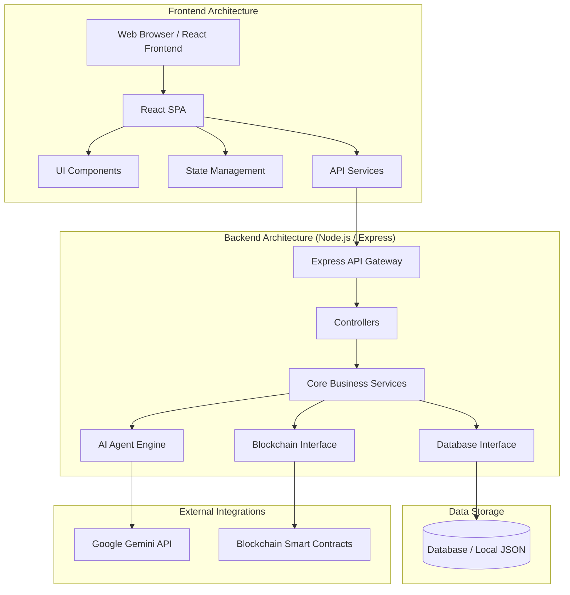

# Architecture Diagram

```mermaid
graph TD
    Client[Web Browser / React Frontend]
    
    subgraph "Frontend Architecture"
        Client --> App[React SPA]
        App --> Components[UI Components]
        App --> Store[State Management]
        App --> Services[API Services]
    end
    
    subgraph "Backend Architecture (Node.js / Express)"
        Services --> API[Express API Gateway]
        API --> Controllers[Controllers]
        Controllers --> CoreServices[Core Business Services]
        CoreServices --> DBInterface[Database Interface]
        CoreServices --> AIEngine[AI Agent Engine]
        CoreServices --> BlockchainInterface[Blockchain Interface]
    end
    
    subgraph "Data Storage"
        DBInterface --> Database[(Database / Local JSON)]
    end
    
    subgraph "External Integrations"
        AIEngine --> Gemini[Google Gemini API]
        BlockchainInterface --> SmartContracts[Blockchain Smart Contracts]
    end
```
