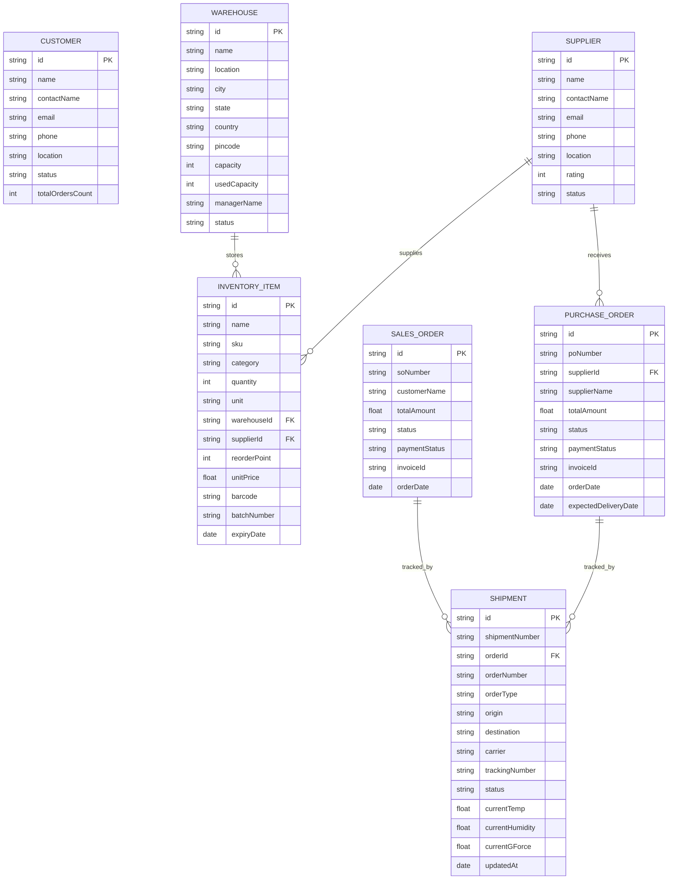

# Database ER Diagram

```mermaid
erDiagram
    CUSTOMER {
        string id PK
        string name
        string contactName
        string email
        string phone
        string location
        string status
        int totalOrdersCount
    }
    
    SUPPLIER {
        string id PK
        string name
        string contactName
        string email
        string phone
        string location
        int rating
        string status
    }
    
    WAREHOUSE {
        string id PK
        string name
        string location
        string city
        string state
        string country
        string pincode
        int capacity
        int usedCapacity
        string managerName
        string status
    }
    
    INVENTORY_ITEM {
        string id PK
        string name
        string sku
        string category
        int quantity
        string unit
        string warehouseId FK
        string supplierId FK
        int reorderPoint
        float unitPrice
        string barcode
        string batchNumber
        date expiryDate
    }
    
    PURCHASE_ORDER {
        string id PK
        string poNumber
        string supplierId FK
        string supplierName
        float totalAmount
        string status
        string paymentStatus
        string invoiceId
        date orderDate
        date expectedDeliveryDate
    }
    
    SALES_ORDER {
        string id PK
        string soNumber
        string customerName
        float totalAmount
        string status
        string paymentStatus
        string invoiceId
        date orderDate
    }
    
    SHIPMENT {
        string id PK
        string shipmentNumber
        string orderId FK
        string orderNumber
        string orderType
        string origin
        string destination
        string carrier
        string trackingNumber
        string status
        float currentTemp
        float currentHumidity
        float currentGForce
        date updatedAt
    }

    SUPPLIER ||--o{ INVENTORY_ITEM : "supplies"
    WAREHOUSE ||--o{ INVENTORY_ITEM : "stores"
    SUPPLIER ||--o{ PURCHASE_ORDER : "receives"
    PURCHASE_ORDER ||--o{ SHIPMENT : "tracked_by"
    SALES_ORDER ||--o{ SHIPMENT : "tracked_by"
```
