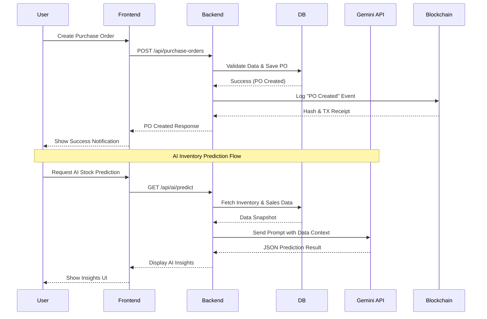

# Sequence Diagram: Purchase Order Creation & AI Prediction

```mermaid
sequenceDiagram
    participant User
    participant Frontend
    participant Backend
    participant DB
    participant AI as Gemini API
    participant Blockchain

    User->>Frontend: Create Purchase Order
    Frontend->>Backend: POST /api/purchase-orders
    Backend->>DB: Validate Data & Save PO
    DB-->>Backend: Success (PO Created)
    
    Backend->>Blockchain: Log "PO Created" Event
    Blockchain-->>Backend: Hash & TX Receipt
    
    Backend-->>Frontend: PO Created Response
    Frontend-->>User: Show Success Notification
    
    Note over User, AI: AI Inventory Prediction Flow
    User->>Frontend: Request AI Stock Prediction
    Frontend->>Backend: GET /api/ai/predict
    Backend->>DB: Fetch Inventory & Sales Data
    DB-->>Backend: Data Snapshot
    Backend->>AI: Send Prompt with Data Context
    AI-->>Backend: JSON Prediction Result
    Backend-->>Frontend: Display AI Insights
    Frontend-->>User: Show Insights UI
```
